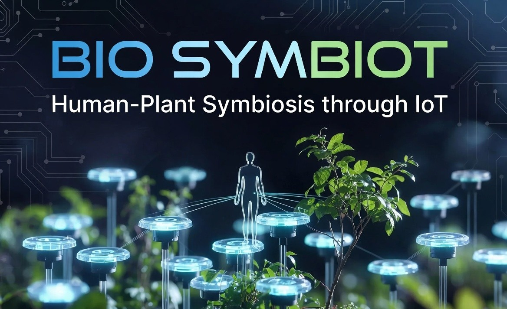

# BIO SYMBIOT

**Bio-Resonant IoT Framework for Precision Microclimate Stabilization and Human-Plant Symbiosis**

An advanced IoT system that monitors and optimizes plant microclimates while mathematically quantifying the symbiotic relationship between tree biological resonance and human limbic well-being in a shared environment for regulation of the same towards overall health and tranquility.

---

Abstract

Inspired by research into plant communication networks, this project treats flora as an active, measurable node in a shared microclimate. We have built a mathematical proxy layer on top of real sensor data to test whether plant-state and human-comfort signals move together in a meaningful and mathematically honest way, proving that plants and humans react similarly in a given microclimate. And the results are amazing, we've achieved a **89.23%** of correlation between the plant's health and human limbic profile, when subjected to the exact same environment, with an alignment rate of **0.796**; which means that there is a 80% chance of predicting one variable, given the other variable. 
Next the project goes onto make use of this data to create a empathetic relationship between trees and humans. We have done that through actuation. 

The system validates a novel dual-bridge asymmetric weighting model for bio-symbiosis research, inspired by Peter Wohlleben’s **The Hidden Life of Trees**.

---

##  Key Features

- **Real-time Autonomous Irrigation** with manual override + 1-minute auto-timeout
- **Multi-sensor Microclimate Monitoring** (Soil Moisture, Ambient Light, Air Quality)
- **Local + Cloud Telemetry** (OLED display + Blynk IoT)
- **Advanced Noise Suppression** using FFT in MATLAB
- **Bio-Symbiosis Analytics** with Pearson correlation & linear regression (R² = 0.7962)
- **Robust Hardware Design** with optocoupler isolation, flyback diode, and star-ground topology
- **Professional PCB** designed in KiCad

---

##  Tech Stack

### Hardware
- **Microcontroller**: NodeMCU ESP8266
- **Sensors**: Capacitive Soil Moisture, BH1750 (Light), MQ-135 (Air Quality)
- **Display**: SSD1306 OLED (I2C)
- **Actuators**: 5V Relay + DC Water Pump
- **PCB**: Custom design in KiCad

### Software
- **Firmware**: Arduino (C++) with Blynk, non-blocking FSM
- **Analytics**: MATLAB (Serial parsing, FFT, regression, Shannon Entropy)
- **EDA**: KiCad

---

##  Results

- **Human-Tree Resonance Correlation**: **89.23%**
- **Predictive Model R²**: **0.7962**
- **System Stability Score** (Shannon Entropy): **27.94%**
- Successfully suppressed EMI and voltage sag issues
- Demonstrated clear asymmetric divergence validating the dual-bridge proxy model

---

## 📁 Project Structure
